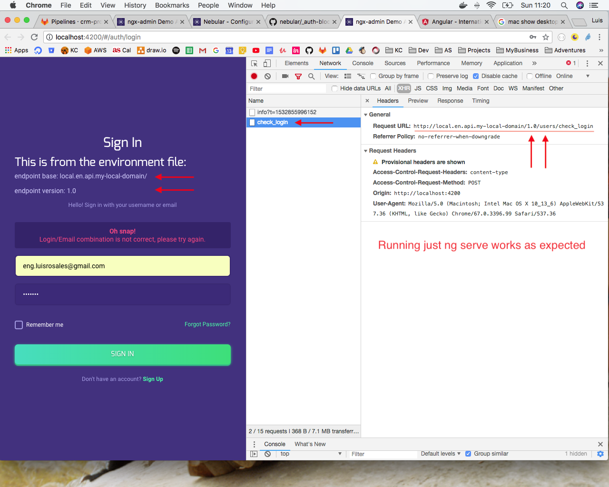
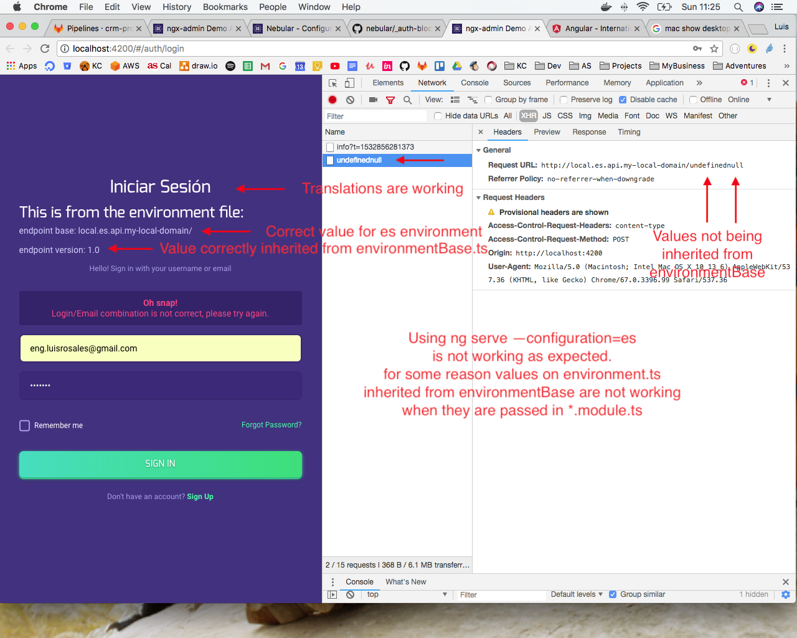

# Issue
Cannot extend environment variables when building or serving with another congifuration.

# Install project.
1. Clone the repo. 
2. cd to project.
3. git checkout starter-kit
4. npm i

Try the following
```bash
# try to serve with default language
ng serve
```
Then go to http://localhost:4200/#/auth/login
Then try to put somenthing, you should see something like this (expected behaviour).


Then the issue, 
Try the following
```bash
# try to serve with another language
ng serve --configuration=es
```
Then go to http://localhost:4200/#/auth/login
Then try to put somenthing, you should see something like this (Unexpected behaviour).

